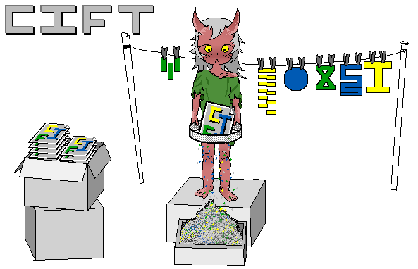

# CIFT
Caltech Intermediate Form parser in pure Python

- github: <https://github.com/maybeetree/cift>
- pypi: <https://pypi.org/project/cift/0.0.1/>

## Under construction

Currently, CIFT is a utility for use in unit tests of RAIMAD,
a different project I am working on.
As such, it is only guaranteed to support CIF files that RAIMAD produces,
and not all CIF files in general.

Turning CIFT into a general-purpose CIF parser is a long-term future goal.

## Roadmap

- [ ] Complete this roadmap
- [ ] Parsing Variants
    - [x] Strict (according to [^1] ) parsing
    - [ ] Klayout-like parsing
        - "lenient" layer names working,
            unclear whether this corresponds 1:1 with kalyout
- [ ] Basic parsing
    - [ ] `P` (polygons)
    - [ ] `B` (box)
        - [ ] rotation
    - [ ] Comments
        - Maybe? Untested
    - [x] Subroutines (`DS` and `DF`)
    - [ ] Translation and rotation (subroutines)
- [ ] Inspection
    - [x] Get CIF file as a list of geometries on each layer
    - [ ] Get CIF file as a tree representing subroutine calls

## Overall Goals
- Pure Python, no dependencies
- easy to understand code
- `mypy --strict` has no complaints

## Name
- "CIFT", pronounced like "sift".
Think of putting a CIF file into a sieve
and letting the syntax crystallize into grains of sand
that fall away to reveal the geometries it represents.

## License

cift is free software: you can redistribute it and/or modify it under the terms
of the GNU Affero General Public License as published by the Free Software
Foundation, version 3 of the License only.

cift is distributed in the hope that it will be useful, but WITHOUT ANY
WARRANTY; without even the implied warranty of MERCHANTABILITY or FITNESS FOR A
PARTICULAR PURPOSE. See the GNU Affero General Public License for more details.

You should have received a copy of the GNU Affero General Public License along
with cift. If not, see <https://www.gnu.org/licenses/>. 

Note: Previous versions of cift were released under different licenses. If the
current license does not meet your needs, you may consider using an earlier
version under the terms of its original license. You can find these versions by
browsing the commit history.

---

Copyright (c) 2025, maybetree.

## Works Cited

[^1]: Sproull, R., & Lyon, R. (1980).
The caltech intermediate form for LSI layout description
(Technical Report No. 2686).
California Institute of Technology, Computer Science
Department, Silicon Structures Project.

